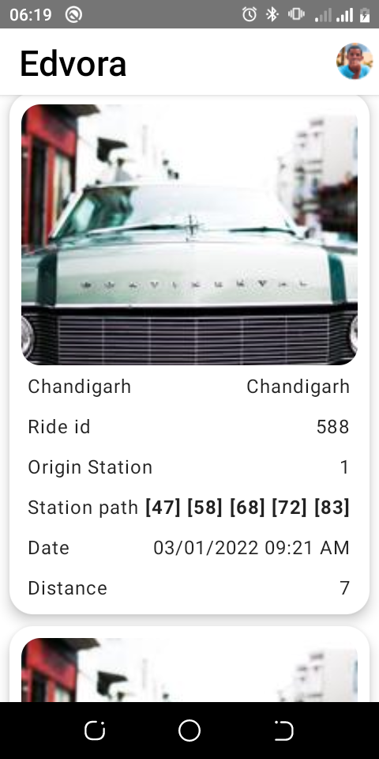

# EdvoraRideApp
An appetizor link to the app can be found here [App Play](https://appetize.io/app/4d7q1epwq86f4geadfr1hkqrk4?device=pixel4&osVersion=11.0&scale=75)

## Screenshots

## Screenshots
A  simple interview project ride app

## Built With 🛠
- [Kotlin](https://kotlinlang.org/) - First class and official programming language for Android development.
- [Retrofit](https://square.github.io/retrofit/) - A type-safe HTTP client for Android and Java.
- [hilt DI on Android](https://kodein.org/Kodein-DI/?5.0/android) - Used for dependecy injection in android
- [Room Persistance](https://developer.android.com/topic/libraries/architecture/room) - The Room persistence library provides an abstraction layer over SQLite to allow for more robust database access while harnessing the full power of SQLite.
- [Kotlin coroutines on Android](https://developer.android.com/kotlin/coroutines) - coroutines help to manage long-running tasks that might otherwise block the main thread and cause your app to become unresponsive.
- [Jetpack Compose]() - UI framework

## TODO
- Filter feature implementation
- Update category numbers
- fetch more data from network logic
- further improve app speed and performance
- show ui for different states
- Code clean up
- Fix a few bugs
- Tests
- Optimisations 

## How to use this project
- Clone the project
- Build and Run the project on a physical device.

## Contact
If you need any help, you can connect with me at :- [maku](https://www.linkedin.com/in/maku-mazakpe-700a3a165/)

